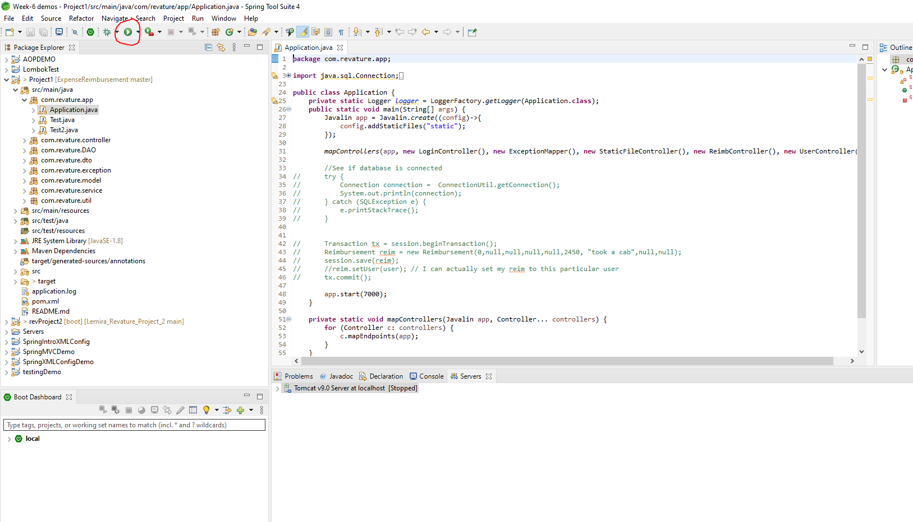

# Project1_ExpenseReimbursement

## Project Description

The purpose of this project is to create a Expense Reimbursement System, which will manage the process of reimbursements requested from employees for work-related expenses. There are two types of users for this system, which are the employees and the finance managers. Employees are able to login to their accounts and view their past tickets and also pending tickets. The Finance Managers are able to login and see both past requests and new requests made by employees. Finance Managers are also able to either accept or deny the requests for expense reimbursements.

## Technologies Used

* Apache Maven - version 3.8.1
* Spring Tool Suite - version 4.10.0
* Visual Studio Code 
* Java SE Development Kit - version 8
* Hibernate-core - version 5.4.30
* Hibernate-ehcache - version 5.4.30
* Mariadb-java-client - version 2.7.2
* Javalin - version 3.13.6
* Logback-classic - version 1.2.3
* Jackson-databind - version 2.12.2
* Mockito-core - version 3.9.0
* Junit - version 4.13.2
* Javascript, HTML, CSS

## Features

List of features ready and TODOs for future development
* Login feature - Users can login to the web application by using their credentials.
* Sign-up feature - Users can sign-up for an account as an employee or finance manager.
* Request feature - employees can make a reimbursement request by submitting information about the expenses
* Processing feature - finance managers can approve or deny the requests made by any employee

To-do list:
* Incorporate better security so that only finance managers can access the view all reimbursements page.
* Have a system in place for signup where people signing up as a finance manager will need to input a security code provided to them in order to create a finance manager account.

## Getting Started
   
(git clone command) 
git clone https://github.com/rlee252/Project1_ExpenseReimbursement.git

(environment setup)
1. Open Spring Tool Suite 4
2. Click the Windows tab and go to Preferences -> Java -> Installed JREs -> Add -> Standard VM
3. Next, click the Directory and find the location of where you downloaded the JDK

## Usage
1. Open the src/main/java folder, then go to the com.revature.app package and run the Application.java as a java application. 

2. open up your browser and go to http://localhost:7000/

## License

This project uses the following license: [<license_name>](<link>).